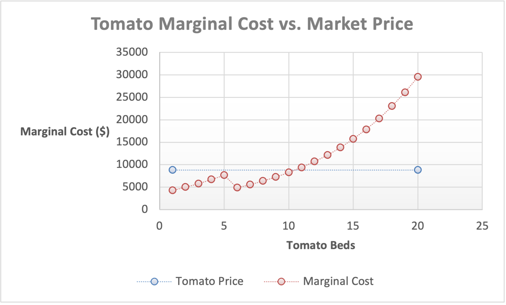
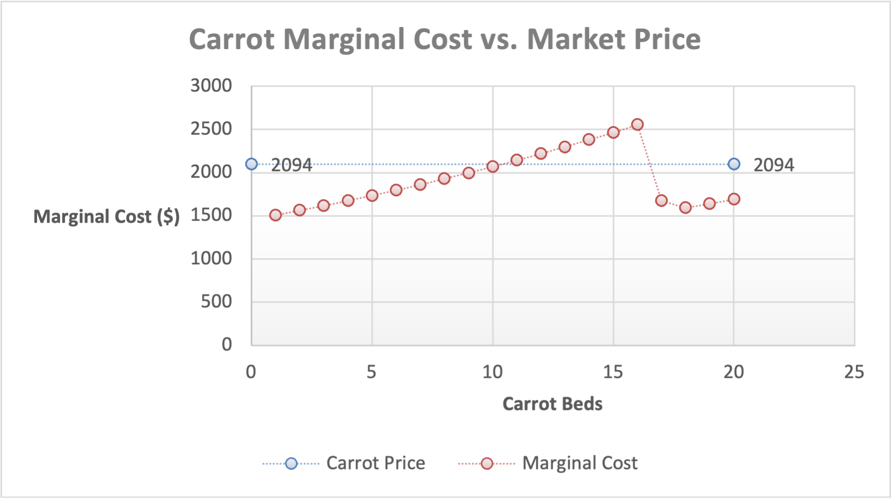
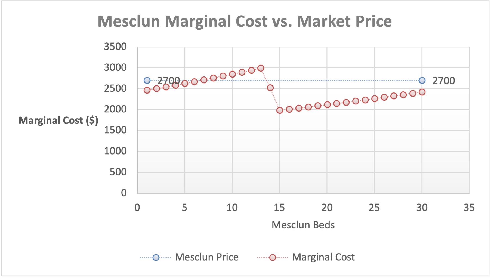

# Perfect Competition — Analysis

## What the Model Found

According to the model, the profit-maximizing crop mix is **10 tomato beds, 20 carrot beds, and 30 mesclun beds**, producing an estimated seasonal profit of **$42,761.66**. The result matches the published check figure of approximately $42,762. (Optimization!B4:B6; Optimization!B33)

This was my own optimizer’s output, which I compared to the assignment’s published check figure.

## Why Tomato Production Stops at 10 Beds

At 10 tomato beds, marginal cost is approximately **$8,248.59**, which is still below the market price of **$8,800 per bed**. Once we advance to 11 beds, marginal cost rises to approximately **$9,390.72**, which is above the market price. (Marginal-Cost Schedules!H16:H17; Marginal-Cost Schedules!B27)

Beyond 10 beds, the next tomato bed would no longer be profitable to the farmer.

Figure 1 shows that the marginal-cost curve crosses the market-price line between beds 10 and 11. The farmer benefits from producing the 10th tomato bed because the additional revenue is greater than the additional cost. The 11th bed would cost more than it brings in at the market price of $8,800, so tomato production should stop at 10 beds.

The tomato marginal-cost schedule gives the clearest example of the **P ≈ MC** decision rule for this model.

*Figure 1. Tomato marginal cost versus the $8,800 market price. Source: Marginal-Cost Schedules!A6:H27.*

An interesting finding was that tomato marginal cost does not rise smoothly. It decreases from **$7,660.86 at bed 5 to $4,906.28 at bed 6**, even though the total labor requirement increases. Cumulative labor reaches **724.73 hours at bed 5 and 956.64 hours at bed 6**, exceeding the farmer's 720 available hours. At bed 5, approximately 4.73 hours of temporary labor are already required, increasing to 236.64 hours at bed 6. (Marginal-Cost Schedules!B11:D12; H11:H12)

The decrease occurs because the farmer's labor is valued at **$34.72 per hour**, while temporary labor costs approximately **$17.36 per hour**. Once the farmer's 720-hour limit is reached, additional labor is charged at the lower temporary-worker rate. This helped me understand that marginal cost is influenced not only by the physical labor required for another bed but also by the cost of that labor. (Optimization!B18:B19)

Total labor demand at the recommended crop mix is approximately **5,277.22 hours**. After the farmer's 720 available hours, the plan uses **4,557.22 temporary-labor hours** out of the maximum 5,760 available. Although the workbook rounds the staffing requirement up to **four temporary workers**, only about 3.16 worker-equivalents are used. Therefore, the temporary-labor-hour constraint is slack rather than binding. (Optimization!B14:B17; Inputs!B26:B27)

The farm also uses only 60 of its 64 available beds, leaving **four beds unused**. This was important because it showed that maximizing profit does not necessarily mean using all available capacity. If another bed costs more to produce than the revenue it brings in, leaving it empty can be the better decision. (Optimization!B34)

## Why the Carrot and Mesclun Caps Matter

In the model, carrots reach their maximum of **20 beds**. At bed 20, standalone carrot marginal cost is approximately **$1,688.95**, while the market price is **$2,094**. (Inputs!B9; Optimization!B5; Marginal-Cost Schedules!H51; Marginal-Cost Schedules!B52)

Figure 2 shows that carrots are still economically attractive when the 20-bed cap is reached. The marginal cost of the 20th bed remains below the market price, which suggests that the farmer would want to plant more carrots if the crop-specific limit were relaxed.

*Figure 2. Carrot marginal cost versus the $2,094 market price. Source: Marginal-Cost Schedules!A31:H52.*

Mesclun shows the same general pattern as carrots. The model reaches the maximum of **30 mesclun beds**. At bed 30, standalone marginal cost is **$2,420.10**, which remains below the **$2,700 market price**. (Inputs!B14; Optimization!B6; Marginal-Cost Schedules!H86; Marginal-Cost Schedules!B87)

Figure 3 shows that mesclun is still economically attractive at the 30-bed cap. Because the marginal cost of the 30th mesclun bed remains below the market price, the model suggests that the farmer would still have an incentive to plant more mesclun if the crop-specific limit were relaxed.

*Figure 3. Mesclun marginal cost versus the $2,700 market price. Source: Marginal-Cost Schedules!A56:H87.*

This means the carrot and mesclun crop limits are binding, while the overall 64-bed limit is not. The farm already has four unused beds, so simply adding more general acreage would not improve the result. The more useful change would be relaxing one of the crop-specific limits.

## Carrot vs. Mesclun Shadow-Price Comparison

I tested this by relaxing each cap by one bed and comparing the change in profit.

Increasing the carrot cap from 20 to 21 raises seasonal profit from approximately **$42,761.66 to $43,114.16**. Using the underlying, unrounded model results, the marginal value of relaxing the carrot cap by one bed is approximately **$352.49**.

Increasing the mesclun cap from 30 to 31 raises seasonal profit to approximately **$43,008.14**. Using the unrounded model results, the marginal value of relaxing the mesclun cap by one bed is approximately **$246.47**.

*The re-solved profits are displayed to two decimal places. The one-cent differences between the displayed profit changes and the reported shadow prices are due to rounding.*

If only one crop-specific limit could be relaxed, I would prioritize **carrot capacity first** because the increase in profit is greater than it is for mesclun. One additional carrot bed is worth about $352 in seasonal profit compared with about $246 for one additional mesclun bed.

The model helped me see that the better question is not simply whether capacity, meaning the number of beds, is available. The more important question is whether producing the next unit adds more revenue than cost.

The estimated shadow prices of $352.49 for carrots and $246.47 for mesclun apply to relaxing each crop-specific cap by one bed. They should not be treated as constant returns from unlimited expansion, because the marginal cost of additional beds increases; for example, the estimated value of carrot bed 22 falls to approximately $298.

## Why Carrots and Mesclun Are Worth Planting Despite Their Apparent Losses

At first glance, carrots and mesclun might appear unprofitable when the farm's entire $20,000 fixed cost is allocated to each crop individually. However, the short-run shutdown rule explains why both crops should remain in the production plan. As long as the market price covers average variable cost (AVC), producing a crop contributes toward fixed costs that the farmer must pay regardless of whether anything is planted.

At the recommended quantity of **20 carrot beds**, total variable cost is approximately **$38,368.92**, giving an AVC of **$1,918.45 per bed**. This is below the market price of **$2,094 per bed**. (Optimization!B5; Marginal-Cost Schedules!G51; Inputs!B10)

Similarly, at **30 mesclun beds**, total variable cost is approximately **$72,922.19**, giving an AVC of **$2,430.74 per bed**, compared with the market price of **$2,700**. At the recommended quantities, both carrots and mesclun satisfy the short-run shutdown rule because their market prices exceed their average variable costs. Although neither crop appears profitable when charged with the farm's entire fixed cost, both make a positive contribution toward covering those costs and should remain in the production plan. (Optimization!B6; Marginal-Cost Schedules!G86; Inputs!B15)

The distinction between average variable cost and average total cost is important. Charging the entire **$20,000 farm fixed cost** against either crop individually can make it appear unprofitable. However, eliminating a crop would not eliminate the farm's fixed expenses. As long as its revenue exceeds its variable costs, keeping it in production helps cover those expenses. (Inputs!B21)

This conclusion applies at the quantities in the recommended plan, not necessarily at every production level. For example, mesclun's AVC exceeds its market price at beds 13 and 14. At the recommended 30 beds, however, price exceeds AVC. This supports keeping both carrots and mesclun in the final crop mix. (Marginal-Cost Schedules!A69:A70; G69:G70; G86; Inputs!B15)

## Modeling Convention and Limitation

The model follows the labor-costing convention used in the specification and published check figures by converting temporary-worker compensation to an hourly rate of approximately **$17.36**.

This differs from my original Stage 1 interpretation that hiring a temporary worker would create the full **$25,000** cost once that worker was needed. I retained the hourly-rate convention because it is the convention used in the final specification and produces results that match the published check figures.

This assumption matters because changing the way temporary labor is charged could change the marginal costs and potentially change the recommended crop mix.

## Comparison With My Stage 1 Hypothesis

My Stage 1 hypothesis was **14 tomato beds, 20 carrot beds, and 30 mesclun beds**, using all 64 available beds. The model found **10 tomato beds, 20 carrot beds, and 30 mesclun beds**, leaving four beds unused.

I was correct that carrots and mesclun would reach their caps, but I overestimated how long the higher revenue from tomatoes would outweigh their rapidly increasing labor cost. I was also wrong in assuming that all available beds should be planted.

The model showed me that having unused capacity does not mean the farm should automatically produce more. The better decision depends on whether the next unit adds more revenue than cost.

## AI Use Disclosure

I used ChatGPT and Claude to help me understand some of the economic concepts, work through problems with the Excel model, organize and draft parts of my analysis, and improve the clarity of my writing. I reviewed the model myself, checked the calculations in Excel, and made the final decisions about the analysis and conclusions.

More detail about how I used AI is included in `prompt-log.md`.
