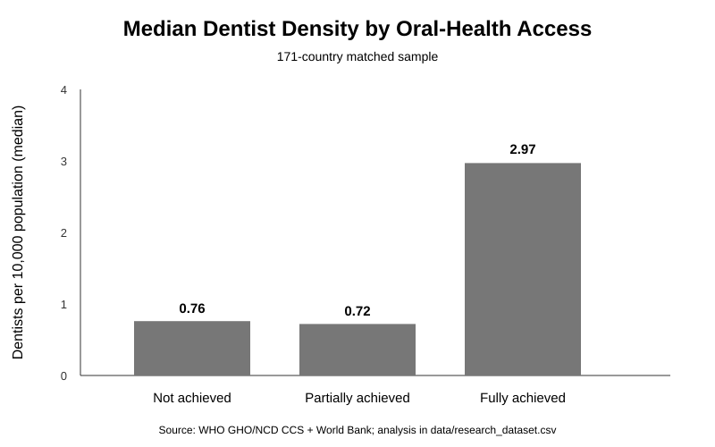
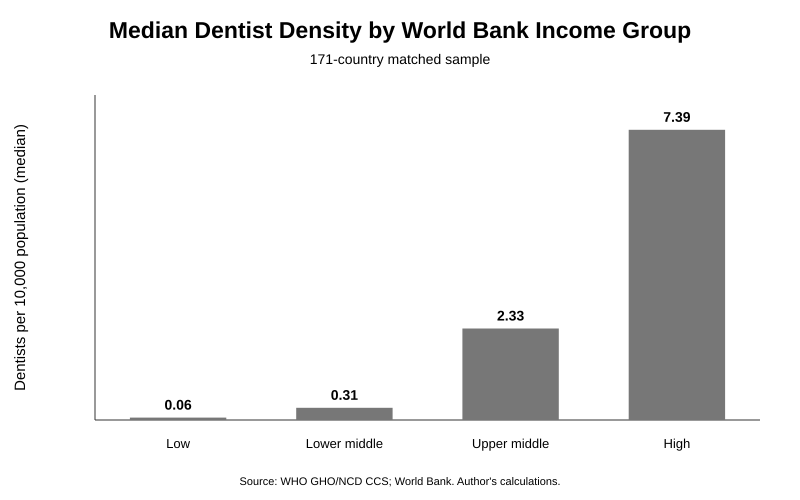

# Global Dental Workforce and Oral-Health Access — Initial Analysis

**Date:** October 3, 2026  
**Primary sample:** 171 countries  
**Fresh-workforce sensitivity sample:** 159 countries with dentist-density observations from 2018–2023

## Research Question

How is dentist workforce density associated with access to oral health care across countries with different income levels?

## Main Finding

Countries classified as having fully achieved availability of the three WHO primary-care oral-health services tend to have more dentists per 10,000 population than countries with only partial or no achievement. However, the relationship is modest, and much of the cross-country pattern appears to be intertwined with national income.

The results therefore support a more nuanced conclusion than "more dentists automatically produce better access." Dentist workforce scarcity appears relevant, but health-system organization, financing, deployment, and use of the available workforce also matter.

## Dentist Density by Oral-Health Access Category

| WHO access category | Countries | Mean dentists / 10,000 | Median | Interquartile range |
|---|---:|---:|---:|---:|
| Not achieved | 23 | 2.41 | 0.76 | 0.13–4.10 |
| Partially achieved | 37 | 2.27 | 0.72 | 0.11–2.80 |
| Fully achieved | 111 | 4.42 | 2.97 | 0.96–7.70 |

The fully achieved group has a substantially higher median dentist density than either of the other groups. However, the partially achieved and not achieved groups have almost identical medians. This means the data do not show a simple step-by-step increase in access as dentist density rises.

Using the ordered WHO access categories, the Spearman rank correlation between dentist density and access is approximately **0.31**, indicating a positive but modest association.

## Sensitivity Check: Recent Workforce Data Only

Restricting the sample to the 159 countries whose dentist-density observations are from 2018–2023 produces a very similar result:

| WHO access category | Countries | Mean dentists / 10,000 | Median | Interquartile range |
|---|---:|---:|---:|---:|
| Not achieved | 21 | 2.52 | 0.76 | 0.14–5.08 |
| Partially achieved | 36 | 2.20 | 0.70 | 0.11–2.71 |
| Fully achieved | 102 | 4.64 | 3.54 | 1.02–7.74 |

The Spearman association rises only slightly, from about **0.31 to 0.33**. The main finding is therefore not being driven by the small number of older workforce observations.

## Dentist Density by World Bank Income Group

| Income group | Countries | Mean dentists / 10,000 | Median | Interquartile range |
|---|---:|---:|---:|---:|
| Low income | 21 | 0.81 | 0.06 | 0.02–0.11 |
| Lower middle income | 42 | 1.10 | 0.31 | 0.15–1.22 |
| Upper middle income | 53 | 3.59 | 2.33 | 1.13–5.24 |
| High income | 55 | 6.85 | 7.39 | 3.77–8.91 |

Income and dentist density are much more strongly associated than dentist density and the oral-health access category. The Spearman correlation between income group and dentist density is approximately **0.74**.

## Oral-Health Access by Income Group

| Income group | Not achieved | Partially achieved | Fully achieved |
|---|---:|---:|---:|
| Low income | 28.6% | 33.3% | 38.1% |
| Lower middle income | 16.7% | 40.5% | 42.9% |
| Upper middle income | 5.7% | 17.0% | 77.4% |
| High income | 12.7% | 7.3% | 80.0% |

The association between income group and access is also positive (Spearman ρ ≈ **0.32**). The largest jump in full achievement occurs between lower-middle-income and upper-middle-income countries.

## What Happens Within Income Groups?

A useful test is to ask whether dentist density still predicts access among countries with broadly similar income levels.

The correlations between dentist density and the ordered access category are:

- Low income: **0.29**
- Lower middle income: **−0.01**
- Upper middle income: **−0.06**
- High income: **0.20**

The relationship is therefore weak or essentially absent within the two middle-income groups. This suggests that the overall cross-country association partly reflects the fact that richer countries tend to have both more dentists and stronger service availability.

This is an important confounding issue: the data support an association between workforce supply and access, but they do not support treating dentist density as the sole mechanism.

## Counterexamples

### Central African Republic — very low dentist density, full service availability

The dataset reports approximately **0.01 dentists per 10,000 population** in 2023 while all three WHO service components are reported as available.

WHO's 2022 country profile independently shows the same pattern: the country had an extremely small dentist workforce, while oral-health screening, urgent treatment, and basic restorative procedures were all reported as available in public-sector primary-care facilities in 2021.

This does not mean that population-level dental access is excellent. The WHO indicator uses a threshold-based, country-reported definition of whether these procedures are generally available in primary-care facilities. The case instead demonstrates why national dentist density and service availability measure different aspects of access.

### Romania — high dentist density, no reported primary-care service availability

Romania provides the opposite case. The matched dataset reports **11.3 dentists per 10,000 population** in 2023, yet the three WHO primary-care components are classified as unavailable.

WHO's country profile also reports all three services as unavailable in public-sector primary-care facilities in 2021 despite a relatively high dentist workforce.

This counterexample is especially useful because it shows that having many dentists nationally does not guarantee that basic oral-health services are organized or available through the public primary-care system.

## Economic Interpretation

The evidence is consistent with several mechanisms:

1. **Scarcity and human capital matter.** Low-income countries have dramatically fewer dentists per population, consistent with limited training capacity, barriers to entry, migration, and constrained health-sector resources.

2. **Income is a major structural factor.** National income is closely associated with dentist supply and is also associated with the WHO access category. This makes income an important confounder rather than merely a background characteristic.

3. **Supply alone is insufficient.** Countries with similar dentist density can fall into different access categories. Workforce deployment, public financing, integration into primary care, incentives, and task sharing may determine whether existing clinical capacity reaches patients.

4. **National averages can conceal distribution problems.** Dentist density is a national ratio and cannot show rural/urban maldistribution or whether dentists are concentrated in private practice and affluent areas.

## Emerging Policy Implication

The preliminary results do **not** support a policy recommendation focused only on producing more dentists.

For countries with severe workforce scarcity, expanding training and retention may still be necessary. But the counterexamples suggest that workforce policy should be paired with measures that improve how scarce clinical capacity is deployed and financed—for example, integration of essential oral-health services into primary care, incentives for underserved areas, and appropriate use of allied oral-health personnel.

This recommendation remains preliminary until the next stage examines the outliers and financing variables more closely.

## Limitations

- The WHO access outcome is based on country-reported availability in public primary-care facilities, not direct patient utilization or affordability.
- Dentist-density observations vary by year, although the 2018–2023 sensitivity analysis produces similar results.
- The analysis is cross-sectional and cannot establish causation.
- Income, health financing, geography, workforce mix, and private-sector structure may confound the relationship.
- National dentist density does not measure within-country distribution.
- Because the three access categories are ordinal, rank correlations and category comparisons are more appropriate than interpreting them as a continuous numerical scale.

## Next Analysis

The next step is to examine the most informative counterexamples and, where data are sufficiently complete, compare financing/benefit-package variables to determine whether they help explain why countries with similar dentist supply achieve different levels of primary-care service availability.
